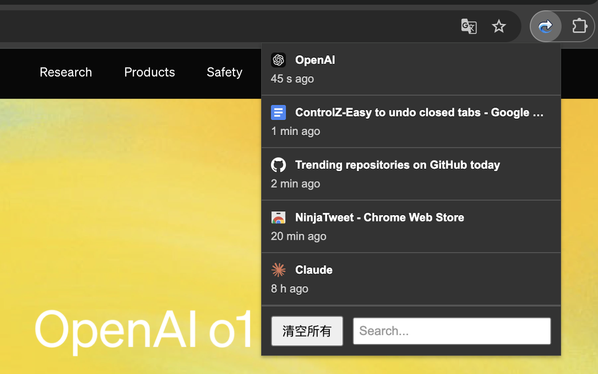

# ControlZ – Easy to undo closed tabs

一个方便查看和管理最近关闭页面的 **Chrome 扩展插件**，帮助您快速找回误关闭的网页。

## 使用指南
- 1. 点击插件图标，会弹出一个显示已关闭标签页的弹窗
- 2. 点击想要恢复的页面即可还原
- 3. 若要删除某个条目，可点击该条目右侧的红色删除按钮

## 功能特性
- **便捷查看最近 20 条记录**：点击扩展程序图标，弹出窗口中显示最近关闭的 20 个页面。
- **显示页面标题和访问时间**：每条记录包含页面的标题和关闭时间，方便您快速识别。
- **一键重新打开页面**：点击列表中的任何一项，即可在新标签页中打开对应的页面。
- **删除单条记录**：将鼠标悬停在某条记录上，点击右侧的“删除”按钮，可以删除该条记录。
- **清空所有记录**：在弹窗底部，提供“清空所有”按钮，一键清除所有历史记录。
- **搜索功能**：在弹窗底部的搜索框中输入关键词，实时搜索匹配的历史记录。

## 功能演示



## 安装方法

### 方法一：从 Chrome Web Store 安装

1. 访问 [Chrome Web Store 中的 ControlZ 插件页面](https://chromewebstore.google.com/detail/controlz-%E2%80%93-easy-to-undo-c/pekcnjhmdcppgnidgnnccmlnmhgamlea)。
2. 点击页面上的 "添加至 Chrome" 按钮。
3. 在弹出的确认窗口中，点击 "添加扩展程序"。
4. 安装完成后，您会在浏览器的工具栏上看到 ControlZ 的图标。

### 方法二：从源码安装

1. **下载源码**

   克隆本仓库到本地：

   ```bash
   git clone https://github.com/yourusername/recently-closed-tabs-helper.git
   ```

2. **加载扩展程序**

   - 打开 Chrome 浏览器，输入 `chrome://extensions/` 进入扩展程序管理页面。
   - 打开页面右上角的“开发者模式”开关。
   - 点击左上角的“加载已解压的扩展程序”按钮。
   - 在文件选择窗口中，选择刚才克隆的项目文件夹。

3. **完成安装**

   扩展程序加载成功后，您会在浏览器的工具栏上看到该扩展程序的图标。
