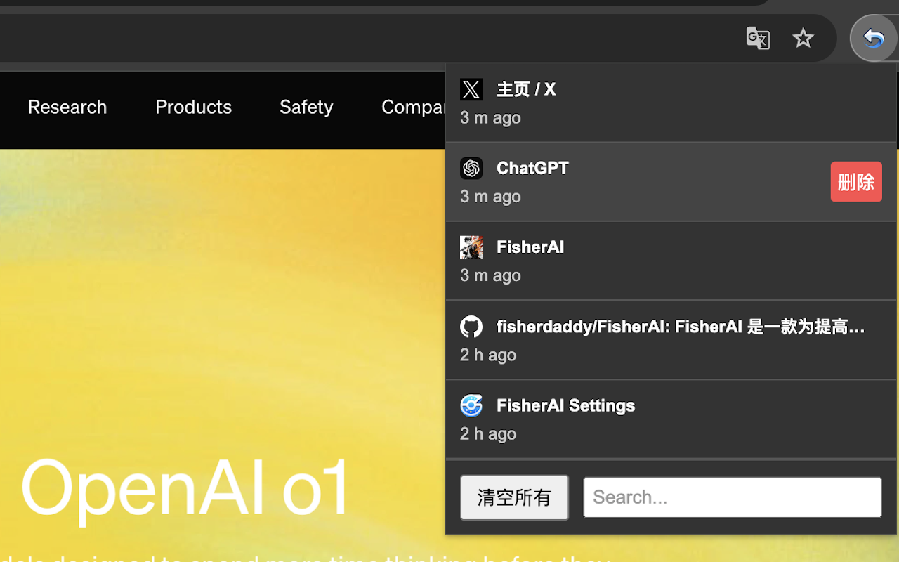

# ControlZ – Easy to undo closed tabs

<p align="center">
  <a href="https://chromewebstore.google.com/detail/controlz-%E2%80%93-easy-to-undo-c/pekcnjhmdcppgnidgnnccmlnmhgamlea">
    
  </a>
  <a href="https://chromewebstore.google.com/detail/controlz-%E2%80%93-easy-to-undo-c/pekcnjhmdcppgnidgnnccmlnmhgamlea">
    
  </a>
  <a href="https://github.com/yourusername/ControlZ/blob/main/LICENSE">
    
  </a>
</p>

<p align="center">
  <b>English</b> | <a href="#controlz--便捷管理已关闭标签页">中文</a>
</p>

A Chrome extension that helps you easily view and manage recently closed tabs. Never lose a tab again!

## 📋 Table of Contents

- [Features](#-features)
- [Demo](#-demo)
- [Installation](#-installation)
- [Usage](#-usage)
- [Configuration](#-configuration)
- [Contributing](#-contributing)
- [License](#-license)

## ✨ Features

- **Access Up to 100 Recently Closed Tabs**: View your recently closed tabs with just one click.
- **Page Title & Timestamp**: Each entry includes the page title and closing time for quick identification.
- **One-Click Restoration**: Simply click on any item to reopen the corresponding page in a new tab.
- **Delete Single Records**: Hover over an entry and click the delete button to remove it from history.
- **Clear All History**: Clear your entire browsing history with the click of a button.
- **Search Functionality**: Quickly find specific pages using the search box.
- **Custom Settings**: Adjust popup size and history items count to your preference.
- **Multilingual Support**: Available in multiple languages including Chinese and English.

## 🎬 Demo

ControlZ makes it easy to find and restore your recently closed tabs:



## 📥 Installation

### From Chrome Web Store

1. Visit the [ControlZ page on Chrome Web Store](https://chromewebstore.google.com/detail/controlz-%E2%80%93-easy-to-undo-c/pekcnjhmdcppgnidgnnccmlnmhgamlea).
2. Click the "Add to Chrome" button.
3. Click "Add Extension" in the confirmation dialog.
4. After installation, you'll see the ControlZ icon in your browser toolbar.

### From Source Code

1. **Clone the repository**:
   ```bash
   git clone https://github.com/fisherdaddy/ControlZ.git
   ```

2. **Load the extension**:
   - Open Chrome and navigate to `chrome://extensions/`.
   - Enable "Developer mode" using the toggle in the top right.
   - Click "Load unpacked" in the top left.
   - Select the cloned project folder.

3. **Complete the installation**:
   - The extension icon will appear in your browser toolbar.

## 🚀 Usage

1. Click the ControlZ icon in your browser toolbar to open the popup.
2. View your recently closed tabs in the list.
3. Click on any entry to reopen that page in a new tab.
4. Use the search box to find specific pages by title or URL.
5. Hover over an entry and click the delete button to remove it from the list.
6. Click the "Clear All" button to remove all history entries.
7. Access settings by clicking the gear icon.

## ⚙️ Configuration

ControlZ offers several customization options:

- **Popup Size**: Adjust the width and height of the extension popup.
- **History Items Count**: Set how many closed tabs to remember (up to 100).
- **Language**: Choose your preferred language.

Access these settings by clicking the gear icon in the popup.


## 📄 License

This project is licensed under the Apache License - see the [LICENSE](LICENSE) file for details.

---

# ControlZ – 便捷管理已关闭标签页

<p align="center">
  <a href="#controlz--easy-to-undo-closed-tabs">English</a> | <b>中文</b>
</p>

一个方便查看和管理最近关闭页面的 **Chrome 扩展插件**，帮助您快速找回误关闭的网页。

## 📋 目录

- [功能特性](#-功能特性)
- [功能演示](#-功能演示)
- [安装方法](#-安装方法)
- [使用指南](#-使用指南)
- [自定义设置](#-自定义设置)
- [参与贡献](#-参与贡献)
- [许可证](#-许可证)

## ✨ 功能特性

- **查看最近 100 条关闭记录**：点击扩展程序图标，即可查看最近关闭的标签页。
- **显示页面标题和关闭时间**：每条记录包含页面的标题和关闭时间，方便您快速识别。
- **一键重新打开页面**：点击列表中的任何一项，即可在新标签页中打开对应的页面。
- **删除单条记录**：将鼠标悬停在某条记录上，点击右侧的"删除"按钮，可以删除该条记录。
- **清空所有记录**：在弹窗底部，提供"清空所有"按钮，一键清除所有历史记录。
- **搜索功能**：在弹窗底部的搜索框中输入关键词，实时搜索匹配的历史记录。
- **自定义设置**：调整弹窗大小和历史记录数量，满足个人使用习惯。
- **多语言支持**：支持中文、英文等多种语言。

## 🎬 功能演示

ControlZ 让您轻松找回已关闭的标签页：


## 📥 安装方法

### 从 Chrome Web Store 安装

1. 访问 [Chrome Web Store 中的 ControlZ 插件页面](https://chromewebstore.google.com/detail/controlz-%E2%80%93-easy-to-undo-c/pekcnjhmdcppgnidgnnccmlnmhgamlea)。
2. 点击页面上的 "添加至 Chrome" 按钮。
3. 在弹出的确认窗口中，点击 "添加扩展程序"。
4. 安装完成后，您会在浏览器的工具栏上看到 ControlZ 的图标。

### 从源码安装

1. **下载源码**：
   ```bash
   git clone https://github.com/fisherdaddy/ControlZ.git
   ```

2. **加载扩展程序**：
   - 打开 Chrome 浏览器，输入 `chrome://extensions/` 进入扩展程序管理页面。
   - 打开页面右上角的"开发者模式"开关。
   - 点击左上角的"加载已解压的扩展程序"按钮。
   - 在文件选择窗口中，选择刚才克隆的项目文件夹。

3. **完成安装**：
   - 扩展程序加载成功后，您会在浏览器的工具栏上看到该扩展程序的图标。

## 🚀 使用指南

1. 点击浏览器工具栏中的 ControlZ 图标，打开弹出窗口。
2. 在列表中查看您最近关闭的标签页。
3. 点击任意条目，即可在新标签页中重新打开该页面。
4. 使用搜索框，通过标题或 URL 查找特定页面。
5. 将鼠标悬停在某条记录上，点击删除按钮可从列表中移除该记录。
6. 点击"清空所有"按钮，可以清除所有历史记录。
7. 点击设置图标，访问扩展设置。

## ⚙️ 自定义设置

ControlZ 提供多种自定义选项：

- **弹窗大小**：调整扩展弹窗的宽度和高度。
- **历史记录数量**：设置要记住的已关闭标签页数量（最多 100 个）。
- **语言选择**：选择您偏好的界面语言。

通过点击弹窗中的设置图标即可访问这些设置。


## 📄 许可证

本项目采用 Apache 许可证 - 详情请查看 [LICENSE](LICENSE) 文件。
